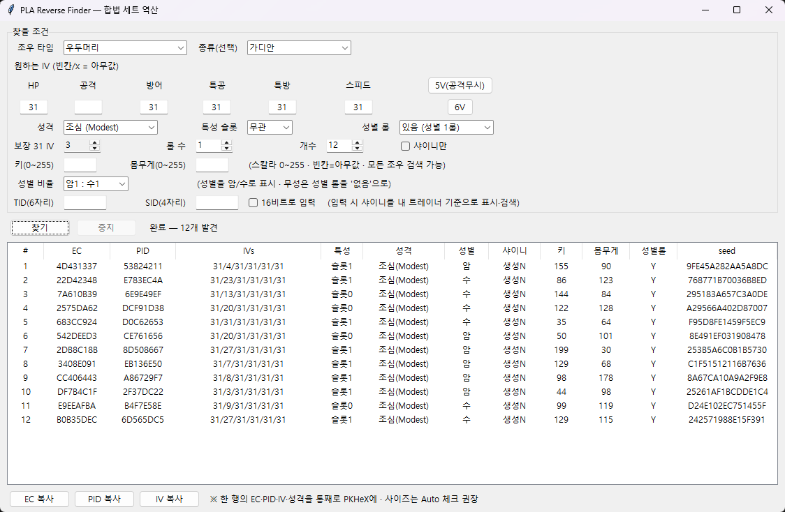

# PLA Reverse Finder

포켓몬 레전즈 아르세우스에서 포획한 포켓몬을 PKHeX로 에딧할 때, 자연산의 경우 PID 유형이 'xoroshiro'로 되어 있다. 이 상태에서 에딧으로 성격이나 개체값을 변경하면 이 PID 유형이 'None'으로 바뀌어 버린다.

이 도구는 해당하는 포켓몬의 성격, 개체값, 성별, 특성, 이로치 여부를 입력하면 가능한 원본 시드, 그에 해당하는 암호화 상수(EC)와 PID 값을 역산하여 PKHeX 상에서 에딧한 포켓몬도 PID 유형이 xoroshiro로 나타나도록 하기 위해 만들어졌다. 추가로 TID와 SID를 넣으면 이로치 포켓몬이 만들어지는 시드도 계산할 수 있다.

...라고 하지만, 이로치의 경우 시스템상 PID가 원본에서 변형되고, 이 변형된 PID에 대한 원본 시드를 추적하는 기능은 PKHeX 자체에 없기 때문에(즉 실제로 알맞은 원본 시드를 찾아 EC와 PID를 넣어도 PKHeX는 그걸 역산하지 않기 때문에), 이로치 포켓몬은 여전히 PID 유형이 xoroshiro로 나타난다. 결과로 나온 값 자체는 이로치 PID가 맞기 때문에 이로치로 표시는 정상적으로 된다. PID 유형이 None이라 찝찝해서 그렇지.

 <!-- 스크린샷을 찍어 docs/ 에 넣으면 여기 표시됩니다 -->

## 특징

- 조우 타입: **야생 오버월드 / 전설·정적 / 우두머리** (전설 및 우두머리는 최소 3V 보정 자동 설정)
- 종류 입력: **한국어·영어 모두** 지원 (예: `크레세리아`, `arceus`), 대소문자 무시
- **성별 자동 판정**: PLA 등장 종의 성별 비율표 내장 → 결과를 암/수/무성으로 표시
- **샤이니 + TID/SID(6자리/4자리)**: 게임 실제 규칙대로 PID를 확정해 합법 샤이니 생성
- 난이도(예상 시도수) 경고, 무작위 seed 샘플링(자연스러운 PID)
- **외부 라이브러리 불필요** — 파이썬 표준 라이브러리만 사용

## 실행

### 1) 파이썬으로 (권장, 소스 그대로)
```bash
python pla_reverse_finder.py
```
- Python 3.8+ 필요. 추가 설치 없음(tkinter 포함 표준 라이브러리만 사용).
- 로직 검증만: `python pla_reverse_finder.py --selftest`

### 2) exe로 (파이썬 없이)
[Releases](../../releases) 에서 `PLA_Reverse_Finder.exe` 를 받아 더블클릭.
(직접 빌드하려면 아래 "빌드" 참고.)

## 파일 구성

| 파일 | 설명 |
|---|---|
| `pla_reverse_finder.py` | 본체 (전부 여기 있음, ~900줄) |
| `pla_gender_data.py` | 종→성별 코드 표 (PokeAPI 기반 자동 생성) |
| `pla_names_ko.py` | 한국어 종명→영어 매핑 (PokeAPI 기반 자동 생성) |
| `text_species.txt` | 종 이름 목록(도감순, 드롭다운용) |
| `USAGE_ko.txt` | 상세 사용 설명(한국어) |
| `build.py` | exe 빌드 스크립트(PyInstaller) |

> `PLA_Reverse_Finder.exe`(약 11MB)는 위 소스에 **파이썬 런타임을 통째로 넣은 빌드 산출물**일 뿐,
> 로직은 전부 `.py` 파일에 있습니다. (그래서 저장소에는 exe를 커밋하지 않고 Release로 배포합니다.)

## 빌드 (exe 만들기)

```bash
pip install pyinstaller
python build.py
```
`dist/PLA_Reverse_Finder.exe` 가 생성됩니다.

## 동작 원리 (요약)

게임의 고정 생성 순서를 그대로 시뮬레이션해 원하는 조건이 나오는 seed를 무작위 탐색합니다:
```
EC → PID(샤이니 롤) → IV → 특성 → [성별 rand(253)+1] → 성격 → 키·몸무게(rand(0x81)+rand(0x80))
```
샤이니는 게임 실제 규칙대로 PID 하위16을 보존하고 상위16만 트레이너 기준으로 확정합니다
(`상위16 = 하위16 ^ (TID^SID) ^ 사각0/별1`). 이 공식은 Lincoln-LM의 `pla-pid-iv` 검증 로직과 일치합니다.

## 크레딧 / 출처

- 원본 [PLA-Live-Map](https://github.com/Lincoln-LM/PLA-Live-Map) (GPL-3.0) — 생성 로직·Xoroshiro 참고
- [Lincoln-LM/pla-reverse](https://github.com/Lincoln-LM/pla-reverse),
  [Lincoln-LM/pla-pid-iv](https://github.com/Lincoln-LM/pla-pid-iv) — 정확한 성별/사이즈/샤이니 PID 공식
- [PokeAPI](https://pokeapi.co/) — 종별 성별 비율 및 한국어 이름 데이터

## 라이선스

[GPL-3.0](LICENSE) (원본 PLA-Live-Map을 따름).

---

⚠️ 개인 세이브 편집용 도구입니다. 온라인 대전/배포 등에 대한 책임은 사용자에게 있습니다.
