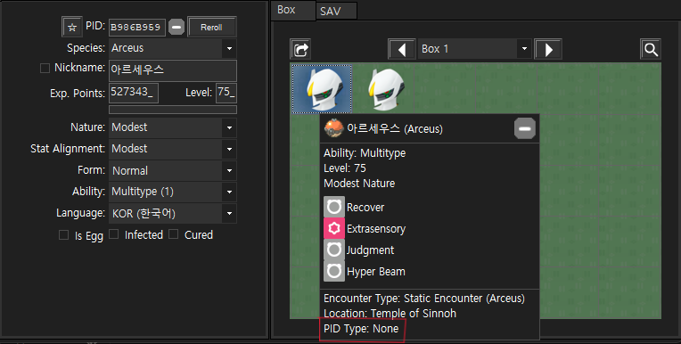
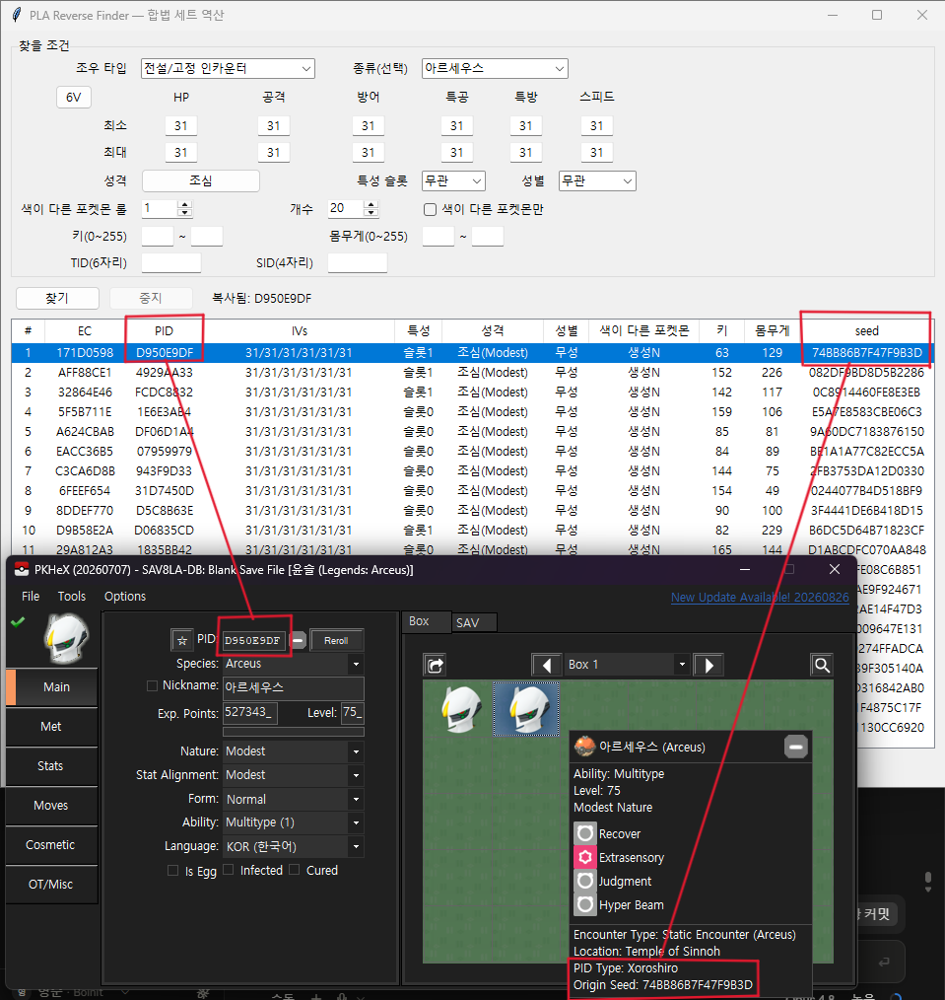

# PLA xoroshiro Finder

포켓몬스터 레전즈 아르세우스에서 포획한 포켓몬을 PKHeX로 에딧할 때, 자연산의 경우 PID 유형이 'xoroshiro'로 되어 있다. 이 상태에서 에딧으로 성격이나 개체값을 변경하면 이 PID 유형이 'None'으로 바뀌어 버린다. xoroshiro는 난수 생성 알고리즘인데, PID나 성격/개체값은 난수에 따라 정해지는거라 에딧으로 결과값만 바꿔버리면 원본 시드를 알 수 없게 되어 None이 되는 것이다.

이 도구는 포켓몬의 성격, 개체값, 성별, 특성, 이로치 여부를 입력하면 가능한 원본 시드, 그에 해당하는 암호화 상수(EC)와 PID 값을 역산하여 PKHeX 상에서 **에딧한 포켓몬도 PID 유형이 xoroshiro로 나타나도록** 하기 위해 만들어졌다. 추가로 TID와 SID를 넣으면 이로치 포켓몬이 만들어지는 시드도 계산할 수 있다.

...라고는 하지만, 이로치의 경우 시스템상 PID가 TID/SID에 따라 변형되고, 변형된 PID에 대한 **원본 시드를 추적하는 기능은 PKHeX에 없기 때문에**(즉 알맞은 원본 시드를 찾아 EC와 PID를 넣어도 PKHeX가 역산하지 않기 때문에), **이로치 포켓몬은 여전히 PID 유형이 xoroshiro로 나타난다**(이 부분은 직접 이로치 포켓몬을 잡아서 검증할 예정). PID 유형이 None이라 찝찝해서 그렇지, 인게임에서 존재 불가능한 개체가 아니며 값 자체도 이로치 PID가 맞기 때문에 게임 내에서는 적법성이 깨지지 않고 이로치로 표시된다.

## 사용 방법

- 조우 타입 선택: **야생 오버월드 / 전설·정적 / 우두머리** (전설 및 우두머리는 최소 3V 보정 자동 설정)
- 포켓몬 종류 입력: **한국어·영어 입력 모두** 지원
- 성격 선택: 다중 선택 가능
- 개체값 입력: 최소/최대를 각각 입력해 범위 설정 가능, 빈칸으로 남기면 제한 없음
- 키/몸무게: 개체값과 동일.
- 이로치 + TID/SID(6자리/4자리): 게임 실제 규칙대로 PID를 확정해 이로치 생성

생성 후 결과창에서 사용할 줄을 클릭하면 하단 EC 복사 / PID 복사로 클립보드에 복사 가능

## 동작 원리

게임의 고정 생성 순서를 그대로 시뮬레이션해 원하는 조건이 나오는 seed를 탐색한다. 브루트 포스 방식이라서 3V 보정도 없는 야생 6V 이로치 이런거 입력하면 시간을 많이 잡아먹고, 그러고도 안 나올 수도 있다.

샤이니는 게임 실제 규칙대로 PID 하위16을 보존하고 상위16은 트레이너 기준으로 정해진다.
**다만 이를 PKHeX가 추적하지 못하기 때문에 이로치 포켓몬의 PID 유형은 None으로 표시된다.**

## 참조

- 원본 [PLA-Live-Map](https://github.com/Lincoln-LM/PLA-Live-Map) (GPL-3.0) — 생성 로직·Xoroshiro 참고
- [Lincoln-LM/pla-reverse](https://github.com/Lincoln-LM/pla-reverse),
  [Lincoln-LM/pla-pid-iv](https://github.com/Lincoln-LM/pla-pid-iv) — 정확한 성별/사이즈/샤이니 PID 공식
- [PokeAPI](https://pokeapi.co/) — 종별 성별 비율 및 한국어 이름 데이터

## 라이선스

[GPL-3.0](LICENSE) (원본 PLA-Live-Map을 따름).

---

⚠️ 개인 세이브 편집용 도구입니다. 온라인 대전/배포 등에 대한 책임은 사용자에게 있습니다.
